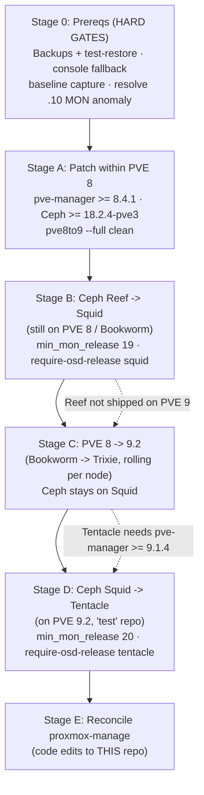

# Runbook: upgrade the 4-node cluster to Proxmox VE 9.2 + Ceph Tentacle 20.2

Last verified: 2026-07-28

## Context

**Why:** The cluster (discovery `.11`, kelvin, excelsior, cerritos) runs **PVE
8.2.4** (Debian Bookworm, kernel 6.8.12) with **Ceph 18.2.2 Reef**,
`no-subscription` repos, healthy quorum, 8 OSDs / 4 MON / 2 MDS / 1 MGR,
`HEALTH_OK`. Reef is heading toward EOL; we want the current release line —
**PVE 9.2** and **Ceph Tentacle 20.2**.

**What this document is:** an operational runbook executed *by hand* against the
live cluster (SSH to `root@192.168.9.12` and the other nodes), over multiple
maintenance windows. Stages 0–D do not modify the `proxmox-manage` repo. **Only
Stage E edits `pmx`, and it happens *after* the cluster is upgraded.**

Proxmox enforces a strict ordering, so this is **three sequential major-version
upgrades**, not one:



Sources: [Upgrade 8→9](https://pve.proxmox.com/wiki/Upgrade_from_8_to_9),
[Reef→Squid](https://pve.proxmox.com/wiki/Ceph_Reef_to_Squid),
[Squid→Tentacle](https://pve.proxmox.com/wiki/Ceph_Squid_to_Tentacle).

**Decisions:**
- Target Ceph **Tentacle 20.2**. ⚠️ For no-subscription, Tentacle is currently
  only on the Ceph **`test`** repo (Squid 19.2.3 is the stable default). Accepted.
- **SSH-only** out-of-band access → tmux mandatory; arrange a console/physical
  fallback before Stage C. A wedged node mid-dist-upgrade may need a physical visit.
- **No backups yet** → standing up + verifying backups is a **hard gate** (Stage 0).
- **3 nodes hold all guests** → live-migrate to evacuate each node; near-zero
  guest downtime.
- The CephFS-wedge runbook lives **in this repo** at
  [`cephfs-client-wedged.md`](cephfs-client-wedged.md); Stage 0 and the
  verification steps reference it.

**Sequencing dependency:** This work waits until `proxmox-manage` (`pmx`)
development settles, because the upgrade *itself* requires editing `pmx`
(hardcoded `reef` repo URL) and re-validating its PVE-CLI output parsing on
PVE 9 — see Stage E. Running both at once would conflate variables.

---

## Stage 0 — Prerequisites (hard gates, do not skip)

- **Backups.** Stand up a Proxmox Backup Server (or at minimum scheduled
  `vzdump` to external storage), back up **every** VM/CT, and **test-restore at
  least one** guest. Do not start Stage A until a clean backup exists.
- **Console fallback.** Confirm a way to reach each node's console without the
  network (IPMI/iKVM if any exists, otherwise physical/crash-cart access),
  since SSH-only + dist-upgrade is the main risk.
- **Baseline capture.** Record `pveversion -v` and `ceph versions` on all four
  nodes; back up `/etc` per node.
- **Investigate the MON-address anomaly.** The CephFS mount string lists 5 IPs
  (`192.168.9.10–.14`) but only **4 MONs** exist (`.11–.14`). Determine what
  `.10` is (stale removed MON? a fifth host?) and clean up the mount/monmap
  before the upgrade so clients don't chase a dead address — directly relevant
  to the wedge documented in [`cephfs-client-wedged.md`](cephfs-client-wedged.md).
- Keep the in-repo CephFS-wedge runbook
  ([`cephfs-client-wedged.md`](cephfs-client-wedged.md)) handy: Stage C reboots
  can re-trigger a stale-session wedge.

## Stage A — Patch within PVE 8 to satisfy upgrade preconditions

The wikis require **pve-manager ≥ 8.4.1** (we're on 8.2.4) and **Ceph
≥ 18.2.4-pve3** (we're on 18.2.2-pve1) before proceeding. Roll through nodes:

```bash
apt update && apt dist-upgrade        # per node; reach 8.4.x + Reef 18.2.4-pve3+
pveversion                            # confirm >= 8.4.1
```

If kernel updates land, reboot each node one at a time **with `ceph osd set
noout`** set, waiting for `HEALTH_OK` between nodes. Then run the checker on
every node and resolve all findings:

```bash
pve8to9 --full
```

## Stage B — Ceph Reef → Squid (still on PVE 8 / Bookworm)

Per [Reef→Squid]. On **all** nodes, switch the Ceph repo:

```bash
sed -i 's/reef/squid/' /etc/apt/sources.list.d/ceph.list
# -> deb http://download.proxmox.com/debian/ceph-squid bookworm no-subscription
apt update && apt full-upgrade        # installs Squid binaries; running daemons keep old version
```

Then **`ceph osd set noout`** and restart daemons **in order, one node at a
time**, verifying health between each:

1. **MONs:** `systemctl restart ceph-mon.target` → confirm
   `ceph mon dump | grep min_mon_release` eventually shows `19 (squid)`.
2. **MGRs:** `systemctl restart ceph-mgr.target`.
3. **OSDs:** `systemctl restart ceph-osd.target` node-by-node; wait for
   `HEALTH_OK`/`active+clean` before the next node.
4. **MDS** (we have 1 active + 2 standby): disable standby-replay, drop to one
   rank, restart, then restore:
   ```bash
   ceph fs set cephfs allow_standby_replay false
   ceph fs set cephfs max_mds 1
   systemctl stop ceph-mds.target      # on standby nodes
   systemctl restart ceph-mds.target   # on the active
   systemctl start ceph-mds.target     # bring standbys back
   ceph fs set cephfs max_mds <orig>   # restore (current standby count)
   ceph fs set cephfs allow_standby_replay true
   ```

Finalize:
```bash
ceph osd require-osd-release squid
ceph osd unset noout
ceph -s        # HEALTH_OK, all daemons 19.2.x
```

## Stage C — PVE 8 → 9.2 (Bookworm → Trixie), rolling per node

Do **one node at a time**; never two at once. Suggested order: a low-criticality
node first to de-risk the procedure, saving the **active-MGR node (discovery)**
and **active-MDS node (kelvin)** for last (their services fail over to standbys
automatically). `ceph osd set noout` for the whole stage; unset at the end.

Per node, **inside `tmux`/`screen`**:

1. Live-migrate all guests off this node (3 nodes hold everything).
2. Repo switch (Debian + PVE + Ceph → Trixie):
   ```bash
   sed -i 's/bookworm/trixie/g' /etc/apt/sources.list /etc/apt/sources.list.d/*.list
   # PVE 9 no-subscription (deb822):
   cat > /etc/apt/sources.list.d/proxmox.sources <<'EOF'
   Types: deb
   URIs: http://download.proxmox.com/debian/pve
   Suites: trixie
   Components: pve-no-subscription
   Signed-By: /usr/share/keyrings/proxmox-archive-keyring.gpg
   EOF
   # Ceph stays Squid for now, on Trixie:
   cat > /etc/apt/sources.list.d/ceph.sources <<'EOF'
   Types: deb
   URIs: http://download.proxmox.com/debian/ceph-squid
   Suites: trixie
   Components: no-subscription
   Signed-By: /usr/share/keyrings/proxmox-archive-keyring.gpg
   EOF
   rm -f /etc/apt/sources.list.d/pve-enterprise.list /etc/apt/sources.list.d/ceph.list
   ```
3. `apt update && apt dist-upgrade` — accept maintainer configs per wiki
   guidance (`/etc/issue`→No, `lvm.conf`→Yes, `sshd_config`→Yes if only
   deprecated-option diffs, `grub`→No unless customized).
4. `reboot` (into kernel 6.14 — reboot even if already on 6.8-equivalent).
5. Verify: `pveversion` → 9.2.x, `ceph --version` → still Squid, node rejoins,
   `ceph -s` → `HEALTH_OK`, guests can migrate back. Then next node.

After all four: `ceph osd unset noout`. HA groups auto-migrate to HA rules once
the whole cluster is on 9.

## Stage D — Ceph Squid → Tentacle (on PVE 9.2)

Preconditions now met (pve-manager 9.2 ≥ 9.1.4; Ceph 19.2.3-pve3+). On all nodes:

```bash
# WARNING: no-subscription Tentacle = the 'test' component:
sed -i 's/squid/tentacle/; s/no-subscription/test/' /etc/apt/sources.list.d/ceph.sources
# -> URIs: http://download.proxmox.com/debian/ceph-tentacle  Suites: trixie  Components: test
apt update && apt full-upgrade
```

`ceph osd set noout`, then same restart order as Stage B (MON → MGR → OSD
node-by-node → MDS dance). Confirm `min_mon_release 20 (tentacle)`. Finalize:

```bash
ceph osd require-osd-release tentacle
ceph osd unset noout
ceph -s        # HEALTH_OK, all daemons 20.2.x
```

Note: MGRs may go briefly unresponsive after the first MON restart — expected;
keep going.

## Stage E — Reconcile `proxmox-manage` with the upgraded cluster

Performed **after** the cluster is on 9.2 + Tentacle. These are edits to *this*
repo. All references below were re-verified against the current tree:

- **Hardcoded Ceph repo URL (must change) — CONFIRMED at
  `ansible/roles/mount_cephfs/tasks/vm.yml:29`:**
  ```yaml
  baseurl: https://download.ceph.com/rpm-reef/el9/$basearch
  ```
  Change `rpm-reef` → `rpm-tentacle` (and the `description: Ceph Reef` on line 28).
  Re-check `el9` vs the Rocky guest's actual RHEL major. Note: `reef`/`ceph.com`
  appears **only** here and in a `docs/implementation-plans/...` history file — no
  other code paths hardcode the release.
- **Re-validate PVE-CLI output parsing on 9.2** (format-drift risk). All
  confirmed present; re-run against real PVE 9 output and adjust if columns moved:
  - `pmx/preflight.py:106-148` — `_parse_names(qm_pct_output)`, the `qm list`/
    `pct list` heuristic (status-word filter set, `---` section switch).
  - `pmx/destroy.py:62-92` — `_query_cluster(ssh_host)`, same dual-section parse.
  - `ansible/roles/create_vm/tasks/main.yml:92-128` — net0 MAC regex
    (`regex_findall('^net0:[^,]*virtio=...')`) and `qm guest cmd
    network-get-interfaces` JSON parse (`from_json | selectattr ...`).
  - `ansible/roles/create_lxc/tasks/main.yml:120-126` — `pct config` hwaddr
    regex (`regex_findall('hwaddr=([0-9A-Fa-f:]+)')`).
- **LXC mountpoint syntax** — `ansible/roles/mount_cephfs/tasks/lxc.yml:39`
  generates `mp{N}: /mnt/pmx-passthrough{subpath},mp={dest},ro=0`; confirm still
  valid under PVE 9 `pct`.
- **CephFS mount options** — `name=admin,secretfile=/etc/ceph/cephfs.secret,
  noatime,_netdev` (defined in `mount_cephfs/defaults/main.yml:10`, used in
  `vm.yml`/`lxc.yml`); confirm these mounts still work under Tentacle.
- **Toolchain on Trixie:** Trixie ships Python 3.13; `pyproject.toml` has
  `requires-python = ">=3.12"` (line 5) and `ansible-core>=2.17,<2.19` (line 8).
  Verify the pin resolves/works on 3.13; relax the upper bound if needed.
- Run the `pmx` integration smoke tests against the upgraded cluster:
  `tests/integration/test_lifecycle.sh`, `test_create_vm.sh`,
  `test_create_lxc.sh`, `test_ad_join.sh`, `test_state_log.sh`,
  `test_kitchen_sink.sh`. Also `uv run pytest tests/ tests/unit/` and
  `uv run ruff check .` after any edits.

---

## Verification (each stage gates the next)

- `ceph -s` → `HEALTH_OK`; `ceph versions` → all daemons on the stage's target.
- `ceph osd require-osd-release` set to the new release; `min_mon_release` bumped
  (19 squid after B, 20 tentacle after D).
- `pveversion` on target; all guests running; live-migration works both ways.
- CephFS mount usable on every node (`timeout 10 ls /mnt/pve/cephfs`) — the wedge
  check from [`cephfs-client-wedged.md`](cephfs-client-wedged.md).
- End state: PVE 9.2 on all 4 nodes, Ceph 20.2 Tentacle, `pmx` smoke tests green.

## Risks & mitigations

- **SSH-only:** tmux every dist-upgrade; console fallback arranged; one node at a
  time, always.
- **No backups:** Stage 0 PBS gate, test-restore.
- **Tentacle on `test` repo:** newer/less battle-tested — accepted; fallback is to
  stop at Squid 19.2.3 if it misbehaves (cluster is fully functional at Squid).
- **MDS restart dance** is the fiddliest step in B and D — follow it exactly; we
  have 2 standbys for safety.
- **Reboots may re-wedge a CephFS client** (see
  [`cephfs-client-wedged.md`](cephfs-client-wedged.md)) — resolve the `.10`
  MON-address anomaly in Stage 0 to reduce the chance.

---

## Appendix: Ceph Reef → Squid → Tentacle — what's changing and where the project is headed

(Context, not action items.)

**Reef (18.2, 2023)** — the baseline we're on. Defaulted RocksDB column-family
**sharding** for OSDs, shipped the **offline read balancer** (manual `pgremapper`/
`upmap-read` style rebalancing of *primary* selection so reads spread evenly), and
hardened the pg-autoscaler. Crimson/SeaStore present but firmly experimental.

**Squid (19.2, late 2024)** — mostly a "make the modern path faster and more
automatic" release:
- **Automatic read balancing** — the `read_balance_score` you can already see in
  this cluster's `osd pool ls detail` output is the Squid-era mechanism; the
  balancer now evens out read-primary distribution online.
- **BlueStore / RocksDB tuning** — faster OSD startup, better compaction defaults,
  improved space accounting.
- **NVMe-oF gateway** — export RBD as NVMe/TCP targets to non-Ceph clients
  (think VMware/bare-metal), a real push into enterprise block.
- **RGW multisite** — live resharding and smoother replication.
- Scrub scheduling made less impactful/more controllable.

**Tentacle (20.2, 2026)** — the current line; continues Squid's direction and
pushes the long-term rewrite:
- More-automated balancing and default-tuning, continued BlueStore work.
- Deprecation cleanup and tightened defaults.
- Crimson/SeaStore continue to mature (still not the production default).

**The big architectural arc — Crimson + SeaStore.** Classic `ceph-osd` was
designed in the HDD era: a thread-pool doing blocking I/O behind locks, with
BlueStore on top of RocksDB. On modern NVMe the bottleneck moved from the disk to
**CPU and lock contention**. **Crimson** is a ground-up OSD rewrite on the
**Seastar** framework (the async, shared-nothing, core-pinned, run-to-completion
reactor behind ScyllaDB): each core owns its data and polls, eliminating context
switches and most locking. **SeaStore** is its purpose-built object store for
NVMe/ZNS, replacing the BlueStore+RocksDB stack. This has been "coming" for
several releases and lands incrementally — the through-line across Reef → Squid →
Tentacle is steadily shifting Ceph from "make it work on commodity HDDs" to "make
it saturate fast NVMe and many-core CPUs," alongside better automatic data
placement and broader protocol reach (NVMe-oF, multisite RGW). For a small
all-SSD homelab cluster like this one, the day-to-day wins are the balancer and
BlueStore improvements; Crimson isn't something you'd switch to yet.
