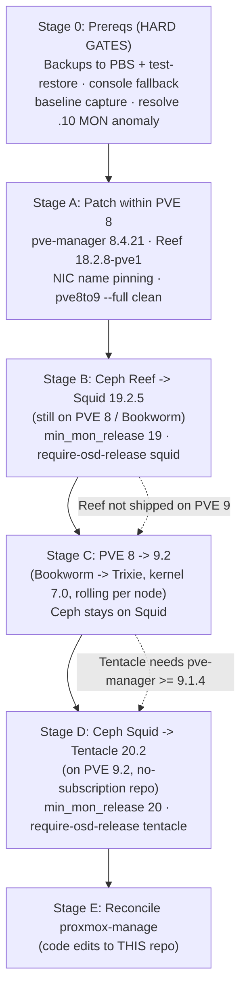

# Runbook: upgrade the 4-node cluster to Proxmox VE 9.2 + Ceph Tentacle 20.2

Last verified: 2026-09-06

## Context

**Why:** The cluster (discovery `.11`, cerritos `.12`, excelsior `.13`, kelvin
`.14`) runs **PVE 8.2.4** (Debian Bookworm, kernel 6.8.12) with **Ceph 18.2.2
Reef**, `no-subscription` repos, healthy quorum, 8 OSDs / 4 MON / 2 MDS / 1 MGR,
`HEALTH_OK`. Re-checked 2026-09-06: unchanged since the runbook was written, 276
packages pending. Reef went fully EOL in March 2026 (final release 18.2.8) and
Squid support ends September 2026. Neither will receive the August 2026 CephX
security fixes. We want the current release line: **PVE 9.2** and **Ceph
Tentacle 20.2**.

**What this document is:** an operational runbook executed *by hand* against the
live cluster (SSH to `root@192.168.9.12` and the other nodes), over multiple
maintenance windows. Stages 0–D do not modify the `proxmox-manage` repo. **Only
Stage E edits `pmx`, and it happens *after* the cluster is upgraded.**

Proxmox enforces a strict ordering, so this is **three sequential major-version
upgrades**, not one:



Sources: [Upgrade 8→9](https://pve.proxmox.com/wiki/Upgrade_from_8_to_9),
[Reef→Squid](https://pve.proxmox.com/wiki/Ceph_Reef_to_Squid),
[Squid→Tentacle](https://pve.proxmox.com/wiki/Ceph_Squid_to_Tentacle),
[PVE Roadmap](https://pve.proxmox.com/wiki/Roadmap),
[Ceph 20.2.4 / 19.2.6 security release](https://ceph.io/en/news/blog/2026/v20-2-4-v19-2-6-combo-released/).

## Target matrix

Everything is `no-subscription`. Every stage keeps Debian, PVE and Ceph on the
same suite; the only off-suite package set is Squid on Bookworm in Stage B, which
Proxmox builds specifically for that step (the `~bpo12` in the version string).
Versions below were read from `download.proxmox.com` on 2026-09-06; expect them
to have moved by the time each stage runs, and re-check.

| Stage | Debian | PVE repo → version | Ceph repo → version | Kernel |
|---|---|---|---|---|
| A (now) | bookworm | `pve bookworm pve-no-subscription` → 8.4.21 | `ceph-reef bookworm no-subscription` → 18.2.8-pve1 | 6.8.12 |
| B | bookworm | same | `ceph-squid bookworm no-subscription` → 19.2.5-1~bpo12+2 | 6.8.12 |
| C | trixie | `pve trixie pve-no-subscription` → 9.2.11 | `ceph-squid trixie no-subscription` → 19.2.5-pve2 | 7.0.14-15 |
| D (end) | trixie | same | `ceph-tentacle trixie no-subscription` → 20.2.2-pve1 | 7.0.14-15 |

**Decisions:**
- **Tentacle from `no-subscription`, not `test`.** Tentacle was promoted out of
  test preview in early 2026 and PVE 9.2 ships it as a stable option. The
  20.2.4-pve4 build with the August CVE fixes is still `test`-only as of
  2026-09-06; we accept running 20.2.2 until 20.2.4 is promoted rather than
  mixing in the test component.
- **Kernel 7.0, the PVE 9.2 default, unpinned.** 6.17.13 and 6.14.11 remain on
  the trixie repo as escape hatches (`proxmox-boot-tool kernel pin`, which works
  with GRUB). Don't pin proactively: the future CephX key rotation (see Stage D)
  requires kernel 7.0 on every kernel client.
- **CephX key rotation to `aes256k` is deferred** to a separate step after
  Stage D, because guests that mount CephFS also need kernel support.
- **Execute from the laptop, never from a cluster guest.** The runbook, the
  PBS encryption key and the planning sessions were all prepared on `neptune`
  (VM 112, disk on `bwrx`). That VM gets live-migrated during Stage C and
  freezes if Ceph so much as blinks. Before Stage A: laptop has its own SSH key
  on all four nodes, a clone of this repo, and a copy of `~/pbs-keys`. From
  then on, `neptune` is just another guest to back up and migrate.
- **Every stage runs inside a `tmux` session on the node itself** (`tmux new
  -s upgrade`, reattach with `tmux attach -t upgrade`). The laptop's SSH
  session is disposable; the node-side tmux is what survives a dropped link.
- **SSH-only, no IPMI on any node** → tmux mandatory; arrange physical/crash-cart
  access before Stage C. A wedged node mid-dist-upgrade needs a physical visit.
- **PBS exists but is empty** → filling and test-restoring it is a **hard gate**
  (Stage 0).
- **3 nodes hold all guests** → live-migrate to evacuate each node; near-zero
  guest downtime.
- The CephFS-wedge runbook lives **in this repo** at
  [`cephfs-client-wedged.md`](cephfs-client-wedged.md); Stage 0 and the
  verification steps reference it.

**Sequencing dependency:** This work waits until `proxmox-manage` (`pmx`)
development settles, because the upgrade *itself* requires editing `pmx`
(hardcoded `reef` repo URL) and re-validating its PVE-CLI output parsing on
PVE 9 — see Stage E. Running both at once would conflate variables.

**Known upgrade issues that do NOT apply here** (checked 2026-09-06, so you don't
have to re-derive them from the wiki):
- cgroup v1 removal — no LXC containers exist on the cluster.
- HA groups → HA rules migration, and the PVE 9.2 "HA disarm stalls upgrades"
  issue — no HA resources or groups defined.
- Kernel 7.0 PCI passthrough breakage — no `hostpci` entries in any VM config.
- Tentacle erasure-coding PG inconsistency bug — all four pools are replicated.
- Kernel 7.0 Windows-VM freeze — Intel Raptor Lake only, fixed in qemu-server
  9.2.0; nodes are AMD Zen 4 (Ryzen 7745HX / 7945HX).
- PVE 9.2 memtest86+ boot-entry bug — nodes boot via GRUB, not
  `proxmox-boot-tool`.
- `/etc/sysctl.conf` no longer honored on PVE 9 — all nodes already keep
  settings in `/etc/sysctl.d/` (`30-ceph-osd.conf`, `99-sysctl.conf`).
  Verify-only.

---

## Stage 0 — Prerequisites (hard gates, do not skip)

- **Backups.** A PBS storage (`Cloud-PBS.com`, hosted, ~245 GiB quota) is
  configured and reachable but holds **zero backups** and there are **no backup
  jobs**. Decision 2026-09-06: back up **100, 101, 105, 112, 113** and the
  templates **9000, 9001**; the rest are rebuildable. RBD shows ~234 GiB
  allocated for that set, but in-guest usage is far lower (100: 15 GiB,
  101: 13 GiB, 105: 13 GiB; 112/113 unknown, no agent), and PBS compresses and
  dedupes zero chunks, so the first full run lands well under the quota with
  room for retention. Checklist, in order:

  1. **Encrypt first.** Done 2026-09-05; key fingerprint starts `82:81:ff:06`.
     Copies: `/etc/pve/priv/storage/Cloud-PBS.com.enc` (cluster) and
     `~/pbs-keys/` on the workstation (key + paper key). Third-party host; switching on later forces a full
     re-upload.
     ```bash
     pvesm set Cloud-PBS.com --encryption-key autogen
     proxmox-backup-client key paperkey \
       --keyfile /etc/pve/priv/storage/Cloud-PBS.com.enc --output-format text
     ```
     Store the paper key somewhere that is not this cluster. Losing it loses
     every backup.
  2. **Guest agent in 112 (neptune) and 113 (bifrost).** Done 2026-09-06.
     For the record: `apt install qemu-guest-agent` in-guest, `qm set <id>
     --agent 1` on the host, then **`qm reboot <id>`**. A reboot from inside
     the guest is not enough; the virtio-serial port only appears when QEMU is
     relaunched, and until then the agent service refuses to start. `qm pending
     <id>` shows whether a config change is still waiting.
  3. **Optional, shrinks the upload a lot:** 100 and 112 have 64 GiB allocated
     but (for 100) 15 GiB in use, because the disks were never trimmed. Add
     `discard=on` to the disk line, reboot the guest, run `fstrim -av` inside.
     Trimmed blocks read as zero and cost nothing on PBS.
  4. **Create the job.**
     ```bash
     pvesh create /cluster/backup --id pbs-nightly --storage Cloud-PBS.com \
       --vmid 100,101,105,112,113,9000,9001 --mode snapshot \
       --schedule '02:00' --prune-backups 'keep-last=3,keep-weekly=4' --enabled 1
     ```
     Notifications: nothing is configured cluster-wide. After Stage A (8.4.x)
     add a webhook target pointing at the ntfy VM (115) and attach it.
  5. **First run by hand on the smallest guest** (`vzdump 9000 --storage
     Cloud-PBS.com --mode snapshot`) and time it. That's your real upload rate
     to the hosted PBS; it decides whether the first full run of everything is
     an evening or a weekend.
  6. **Node config.** vzdump doesn't cover `/etc/pve` or `/etc`. On each node:
     ```bash
     export PBS_PASSWORD="$(cat /etc/pve/priv/storage/Cloud-PBS.com.pw)"
     proxmox-backup-client backup etc.pxar:/etc pve.pxar:/etc/pve \
       --repository '5i0tqrtf1tddhj1y2o@pbs!Daystrom@sh14-226.prod.cloud-pbs.com:5i0tqrtf1tddhj1y2o' \
       --backup-id "$(hostname)" --keyfile /etc/pve/priv/storage/Cloud-PBS.com.enc
     ```
     Re-run this immediately before Stage C on each node.
  7. **Test-restore** one guest to a fresh VMID on `bwrx`, NIC link-down so it
     doesn't fight the original for its IP, boot, log in, destroy:
     ```bash
     qmrestore 'Cloud-PBS.com:backup/vm/105/<timestamp>' 9105 --storage bwrx
     qm set 9105 --net0 virtio,bridge=vmbr0,link_down=1
     qm start 9105 && qm terminal 9105     # log in, poke around
     qm stop 9105 && qm destroy 9105 --purge
     ```
     This closes the gate. Do not start Stage A until it has passed.
- **Console fallback.** No node has IPMI. Confirm physical/crash-cart access to
  each node, since SSH-only + dist-upgrade is the main risk.
- **Baseline capture.** Record `pveversion -v`, `ceph versions`, `ceph osd dump`,
  `ceph auth ls` (redacted), and `ip -br link` on all four nodes.
- **Investigate the MON-address anomaly.** Still present 2026-09-06: the CephFS
  mount string lists 5 IPs (`192.168.9.10–.14`) but only **4 MONs** exist
  (`.11–.14`). Determine what `.10` is (stale removed MON? a fifth host?) and
  clean up the mount/monmap before the upgrade so clients don't chase a dead
  address — directly relevant to the wedge documented in
  [`cephfs-client-wedged.md`](cephfs-client-wedged.md).
- Keep the in-repo CephFS-wedge runbook
  ([`cephfs-client-wedged.md`](cephfs-client-wedged.md)) handy: Stage C reboots
  can re-trigger a stale-session wedge.

## Stage A — Patch within PVE 8 to satisfy upgrade preconditions

The 8→9 wiki requires **pve-manager ≥ 8.4.1** (we're on 8.2.4); Reef→Squid only
needs 8.2.8 but we're going to 8.4 anyway. Ceph must be **≥ 18.2.4-pve3** (we're
on 18.2.2-pve1); the bookworm no-subscription repo offers 18.2.8-pve1, the final
Reef release. Roll through nodes:

```bash
apt update && apt dist-upgrade        # per node; reach 8.4.21 + Reef 18.2.8-pve1
pveversion                            # confirm >= 8.4.1
```

If kernel updates land, reboot each node one at a time **with `ceph osd set
noout`** set, waiting for `HEALTH_OK` between nodes.

**Pin NIC names** (new in 8.4, required before Stage C). Kernel 7.0 exposes more
hardware features and can change PCI-path-derived names. Every node's `vmbr0`
bridges a bare `enp1s0f0`/`enp1s0` (Intel 82599ES 10G, `ixgbe`); if that name
changes the host boots with no network, and there's no IPMI to fix it from.

```bash
pve-network-interface-pinning generate   # rewrites /etc/network/interfaces to nicN names
cat /etc/network/interfaces              # review: vmbr0 must reference the pinned name
reboot                                   # one node at a time, noout set
```

Then run the checker on every node and resolve all findings:

```bash
pve8to9 --full
```

## Stage B — Ceph Reef → Squid (still on PVE 8 / Bookworm)

Per [Reef→Squid]. On **all** nodes, switch the Ceph repo:

```bash
sed -i 's/reef/squid/' /etc/apt/sources.list.d/ceph.list
# -> deb http://download.proxmox.com/debian/ceph-squid bookworm no-subscription
apt update && apt full-upgrade        # installs Squid 19.2.5 binaries; running daemons keep old version
```

Then **`ceph osd set noout`** and restart daemons **in order, one node at a
time**, verifying health between each:

1. **MONs:** `systemctl restart ceph-mon.target` → confirm
   `ceph mon dump | grep min_mon_release` eventually shows `19 (squid)`.
2. **MGRs:** `systemctl restart ceph-mgr.target`.
3. **OSDs:** `systemctl restart ceph-osd.target` node-by-node; wait for
   `HEALTH_OK`/`active+clean` before the next node.
4. **MDS** (we have 1 active + 2 standby): disable standby-replay, drop to one
   rank, restart, then restore:
   ```bash
   ceph fs set cephfs allow_standby_replay false
   ceph fs set cephfs max_mds 1
   systemctl stop ceph-mds.target      # on standby nodes
   systemctl restart ceph-mds.target   # on the active
   systemctl start ceph-mds.target     # bring standbys back
   ceph fs set cephfs max_mds <orig>   # restore (current standby count)
   ceph fs set cephfs allow_standby_replay true
   ```

Finalize:
```bash
ceph osd require-osd-release squid
ceph osd unset noout
ceph -s        # HEALTH_OK, all daemons 19.2.x
```

## Stage C — PVE 8 → 9.2 (Bookworm → Trixie, kernel 7.0), rolling per node

Do **one node at a time**; never two at once. Suggested order: a low-criticality
node first to de-risk the procedure, saving the **active-MGR node (discovery)**
and **active-MDS node (kelvin)** for last (their services fail over to standbys
automatically). `ceph osd set noout` for the whole stage; unset at the end.

Per node, **inside `tmux`/`screen`**:

1. Live-migrate all guests off this node (3 nodes hold everything).
2. Repo switch. Write all three as deb822 `.sources` files and delete the old
   `.list` files, rather than `sed`-ing `bookworm`→`trixie`: the Debian security
   suite changes shape (`security.debian.org bookworm-security` becomes
   `security.debian.org/debian-security trixie-security`) and a blanket `sed`
   gets that wrong.
   ```bash
   cat > /etc/apt/sources.list.d/debian.sources <<'SRC'
   Types: deb
   URIs: http://ftp.us.debian.org/debian
   Suites: trixie trixie-updates
   Components: main contrib
   Signed-By: /usr/share/keyrings/debian-archive-keyring.gpg

   Types: deb
   URIs: http://security.debian.org/debian-security
   Suites: trixie-security
   Components: main contrib
   Signed-By: /usr/share/keyrings/debian-archive-keyring.gpg
   SRC

   cat > /etc/apt/sources.list.d/proxmox.sources <<'SRC'
   Types: deb
   URIs: http://download.proxmox.com/debian/pve
   Suites: trixie
   Components: pve-no-subscription
   Signed-By: /usr/share/keyrings/proxmox-archive-keyring.gpg
   SRC

   # Ceph stays Squid for now, on Trixie:
   cat > /etc/apt/sources.list.d/ceph.sources <<'SRC'
   Types: deb
   URIs: http://download.proxmox.com/debian/ceph-squid
   Suites: trixie
   Components: no-subscription
   Signed-By: /usr/share/keyrings/proxmox-archive-keyring.gpg
   SRC

   : > /etc/apt/sources.list
   rm -f /etc/apt/sources.list.d/pve-enterprise.list /etc/apt/sources.list.d/ceph.list
   ```
   The current sources have no `non-free-firmware` and both NICs (`ixgbe`,
   `r8169`) work; don't add it.
3. `apt update && apt dist-upgrade` — accept maintainer configs per wiki
   guidance (`/etc/issue`→No, `lvm.conf`→Yes, `sshd_config`→Yes if only
   deprecated-option diffs, `grub`→No unless customized).
4. `reboot` into kernel **7.0.14-x** (the PVE 9.2 default). Reboot even if
   `apt` didn't complain.
5. Verify: `pveversion` → 9.2.x; `uname -r` → `7.0.x-pve`; `ip -br link` shows
   the pinned NIC names up and `vmbr0` carrying traffic; `ceph --version` →
   still Squid; node rejoins; `ceph -s` → `HEALTH_OK`; guests can migrate back.
   Early 7.0.x builds had an `ixgbe` tx-hang regression (fixed by 7.0.14-5), so
   push some traffic over the 10G link before calling the node done. Then next
   node.

After all four: `ceph osd unset noout`.

## Stage D — Ceph Squid → Tentacle (on PVE 9.2)

Preconditions now met (pve-manager 9.2 ≥ 9.1.4; Ceph 19.2.5 ≥ 19.2.3-pve3). On
all nodes:

```bash
sed -i 's/ceph-squid/ceph-tentacle/' /etc/apt/sources.list.d/ceph.sources
# -> URIs: http://download.proxmox.com/debian/ceph-tentacle  Suites: trixie  Components: no-subscription
apt update && apt full-upgrade
```

Check `apt policy ceph` first: if 20.2.4-pve4 or later has reached
`no-subscription`, you get the August 2026 CVE fixes for free. If it's still
`test`-only, proceed with 20.2.2 — that's the accepted decision.

`ceph osd set noout`, then same restart order as Stage B (MON → MGR → OSD
node-by-node → MDS dance). Confirm `min_mon_release 20 (tentacle)`. Finalize:

```bash
ceph osd require-osd-release tentacle
ceph osd unset noout
ceph -s        # HEALTH_OK, all daemons 20.2.x
```

Note: MGRs may go briefly unresponsive after the first MON restart — expected;
keep going.

### Stage D+ — CephX key rotation (separate window, only once on ≥ 20.2.4)

Ceph 20.2.4 / 19.2.6 (2026-08-19) fix CVE-2025-30156, a CephX auth bypass from
unauthenticated AES-CBC. The fix adds a new key type, `aes256k`, and rotating
existing keys to it is the remediation. **Every kernel client of a rotated key
needs kernel 7.0 or newer** — that's the nodes' own CephFS mounts (fine on PVE
9.2's kernel) *and* every guest the `mount_cephfs` role has pointed at CephFS
(Rocky 9 and Ubuntu 24.04 guests, whose stock kernels don't have it yet). So:

1. Don't rotate until all daemons are ≥ 20.2.4 and all four nodes run kernel 7.0.
2. Inventory which guests mount CephFS and which key they use.
3. Rotate node-side keys first; leave guest client keys on the old type until
   the guest kernels gain `aes256k` (check vendor backports), then rotate those.
4. Expect the six new `aes256k`-transition health warnings; they're documented
   as normal.

CVE-2026-50152 (any CephX key can read the monitor config-key store) is fixed by
the upgrade itself; upstream guidance on rotating secrets stored there is still
pending. Note for Stage E: guests currently receive the **admin** key via
`mount_cephfs`, which makes this CVE moot for them but is worth scoping down.

## Stage E — Reconcile `proxmox-manage` with the upgraded cluster

Performed **after** the cluster is on 9.2 + Tentacle. These are edits to *this*
repo. All references below were re-verified against the current tree:

- **Hardcoded Ceph repo URL (must change) — CONFIRMED at
  `ansible/roles/mount_cephfs/tasks/vm.yml:29`:**
  ```yaml
  baseurl: https://download.ceph.com/rpm-reef/el9/$basearch
  ```
  Change `rpm-reef` → `rpm-tentacle` (and the `description: Ceph Reef` on line 28).
  Re-check `el9` vs the Rocky guest's actual RHEL major. Note: `reef`/`ceph.com`
  appears **only** here and in a `docs/implementation-plans/...` history file — no
  other code paths hardcode the release.
- **Provision guests with `discard=on` (new, found 2026-09-05).** No role sets
  `discard` anywhere: `seed_ubuntu_vm/tasks/main.yml:62` and
  `seed_rocky_vm/tasks/main.yml:62` build `--scsi0 {{ default_storage }}:...`
  without it, `create_vm` only clones and `qm resize`s, and `attach_rbd_disk`
  passes the disk straight through. Every VM `pmx` creates therefore never
  releases freed blocks back to RBD, so its image grows monotonically toward
  fully-allocated and its PBS backups carry the dead data forever. Measured on
  the live cluster: VM 101 sat at 63 GiB allocated for 12.8 GiB of real data.
  Add `,discard=on` in the two seed roles (templates propagate it to clones) and
  in `attach_rbd_disk`. Guests also need periodic `fstrim` — Ubuntu and Rocky
  both ship the `fstrim.timer` unit, so confirm it is enabled rather than
  writing a cron job.
- **Scoped CephFS client key.** `mount_cephfs/defaults/main.yml:10` hands guests
  `name=admin`. Create a restricted `client.pmx-cephfs` key (CephFS-only caps)
  and switch the role to it. Not strictly an upgrade item, but Stage D+ key
  rotation is far simpler when guests don't hold the admin key.
- **Re-validate PVE-CLI output parsing on 9.2** (format-drift risk). All
  confirmed present; re-run against real PVE 9 output and adjust if columns moved:
  - `pmx/preflight.py:106-148` — `_parse_names(qm_pct_output)`, the `qm list`/
    `pct list` heuristic (status-word filter set, `---` section switch).
  - `pmx/destroy.py:62-92` — `_query_cluster(ssh_host)`, same dual-section parse.
  - `ansible/roles/create_vm/tasks/main.yml:92-128` — net0 MAC regex
    (`regex_findall('^net0:[^,]*virtio=...')`) and `qm guest cmd
    network-get-interfaces` JSON parse (`from_json | selectattr ...`).
  - `ansible/roles/create_lxc/tasks/main.yml:120-126` — `pct config` hwaddr
    regex (`regex_findall('hwaddr=([0-9A-Fa-f:]+)')`).
- **LXC mountpoint syntax** — `ansible/roles/mount_cephfs/tasks/lxc.yml:39`
  generates `mp{N}: /mnt/pmx-passthrough{subpath},mp={dest},ro=0`; confirm still
  valid under PVE 9 `pct`.
- **CephFS mount options** — `name=admin,secretfile=/etc/ceph/cephfs.secret,
  noatime,_netdev` (defined in `mount_cephfs/defaults/main.yml:10`, used in
  `vm.yml`/`lxc.yml`); confirm these mounts still work under Tentacle.
- **Toolchain:** `pmx` runs on the Ubuntu workstation and SSHes to the nodes, so
  Trixie's Python 3.13 is irrelevant to it. Nothing to do here.
- Run the `pmx` integration smoke tests against the upgraded cluster:
  `tests/integration/test_lifecycle.sh`, `test_create_vm.sh`,
  `test_create_lxc.sh`, `test_ad_join.sh`, `test_state_log.sh`,
  `test_kitchen_sink.sh`. Also `uv run pytest tests/ tests/unit/` and
  `uv run ruff check .` after any edits.

---

## Verification (each stage gates the next)

- `ceph -s` → `HEALTH_OK`; `ceph versions` → all daemons on the stage's target.
- `ceph osd require-osd-release` set to the new release; `min_mon_release` bumped
  (19 squid after B, 20 tentacle after D).
- `pveversion` on target; all guests running; live-migration works both ways.
- CephFS mount usable on every node (`timeout 10 ls /mnt/pve/cephfs`) — the wedge
  check from [`cephfs-client-wedged.md`](cephfs-client-wedged.md).
- End state: PVE 9.2 on all 4 nodes, kernel 7.0, Ceph 20.2 Tentacle from
  `no-subscription`, `pmx` smoke tests green.

## Risks & mitigations

- **SSH-only, no IPMI:** tmux every dist-upgrade; physical access arranged; NIC
  names pinned in Stage A; one node at a time, always.
- **Backups:** Stage 0 PBS gate, test-restore, quota sized to fit.
- **Tentacle 20.2.2 lacks the August CVE fixes** until 20.2.4 is promoted to
  `no-subscription`. Accepted: the cluster is LAN-only; re-check `apt policy
  ceph` at Stage D and again periodically afterward. Fallback if Tentacle
  misbehaves is Squid 19.2.5, but Squid support ends September 2026, so that's a
  short-term parking spot only.
- **Kernel 7.0 regressions:** 6.17.13 stays available on the trixie repo;
  `proxmox-boot-tool kernel pin 6.17.13-x-pve` works with GRUB. Pinning blocks
  the Stage D+ key rotation, so treat it as temporary.
- **MDS restart dance** is the fiddliest step in B and D — follow it exactly; we
  have 2 standbys for safety.
- **Reboots may re-wedge a CephFS client** (see
  [`cephfs-client-wedged.md`](cephfs-client-wedged.md)) — resolve the `.10`
  MON-address anomaly in Stage 0 to reduce the chance.

---

## Appendix: Ceph Reef → Squid → Tentacle — what's changing and where the project is headed

(Context, not action items.)

**Reef (18.2, 2023; EOL March 2026)** — the baseline we're on. Defaulted RocksDB
column-family **sharding** for OSDs, shipped the **offline read balancer** (manual
`pgremapper`/`upmap-read` style rebalancing of *primary* selection so reads spread
evenly), and hardened the pg-autoscaler. Crimson/SeaStore present but firmly
experimental.

**Squid (19.2, late 2024; support ends September 2026)** — mostly a "make the
modern path faster and more automatic" release:
- **Automatic read balancing** — the `read_balance_score` you can already see in
  this cluster's `osd pool ls detail` output is the Squid-era mechanism; the
  balancer now evens out read-primary distribution online.
- **BlueStore / RocksDB tuning** — faster OSD startup, better compaction defaults,
  improved space accounting.
- **NVMe-oF gateway** — export RBD as NVMe/TCP targets to non-Ceph clients
  (think VMware/bare-metal), a real push into enterprise block.
- **RGW multisite** — live resharding and smoother replication.
- Scrub scheduling made less impactful/more controllable.

**Tentacle (20.2, November 2025)** — the current line; continues Squid's
direction and pushes the long-term rewrite:
- More-automated balancing and default-tuning, continued BlueStore work.
- Fast erasure-coding optimizations (opt-in; had PG-inconsistency bugs through
  20.2.2 — irrelevant to our replicated pools).
- Deprecation cleanup and tightened defaults.
- 20.2.4 (August 2026) reworked CephX with the `aes256k` key type — the first
  new CephX key type in Ceph's history.
- Crimson/SeaStore continue to mature (still not the production default).

**The big architectural arc — Crimson + SeaStore.** Classic `ceph-osd` was
designed in the HDD era: a thread-pool doing blocking I/O behind locks, with
BlueStore on top of RocksDB. On modern NVMe the bottleneck moved from the disk to
**CPU and lock contention**. **Crimson** is a ground-up OSD rewrite on the
**Seastar** framework (the async, shared-nothing, core-pinned, run-to-completion
reactor behind ScyllaDB): each core owns its data and polls, eliminating context
switches and most locking. **SeaStore** is its purpose-built object store for
NVMe/ZNS, replacing the BlueStore+RocksDB stack. This has been "coming" for
several releases and lands incrementally — the through-line across Reef → Squid →
Tentacle is steadily shifting Ceph from "make it work on commodity HDDs" to "make
it saturate fast NVMe and many-core CPUs," alongside better automatic data
placement and broader protocol reach (NVMe-oF, multisite RGW). For a small
all-SSD homelab cluster like this one, the day-to-day wins are the balancer and
BlueStore improvements; Crimson isn't something you'd switch to yet.
